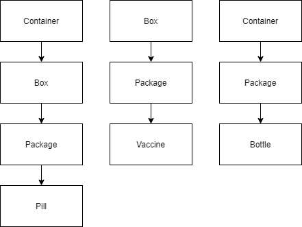

# Design Patterns Project
This is a Software Engineering project that intends to implement some of the design patterns in Java.

# Requirements:
  ### Global authentication:
    Driver authentication must be implemented in a global object with the usernames and passwords
      
  ### Level Storing:
    Containers (Group of Boxes);
    Box (Vaccine/Bottle/Packing)

  </img>

  
  ### Calculate Cost of Transport:
    5% (TAX) Normal Periods
    10% (TAX) Special Periods
    New TAX systems can be added
      
  ### Reutilize the already created Containers and Boxes:
    Boxes and containers can be reused.
    So during the process of creating objects belonging to one of these types, the possibility should be given to reuse an object already existing.
    The creation or reuse of objects is done using a Factory.   
# Solutions:
    - Singleton (Authentication);
    - Factory (Reutilization);
